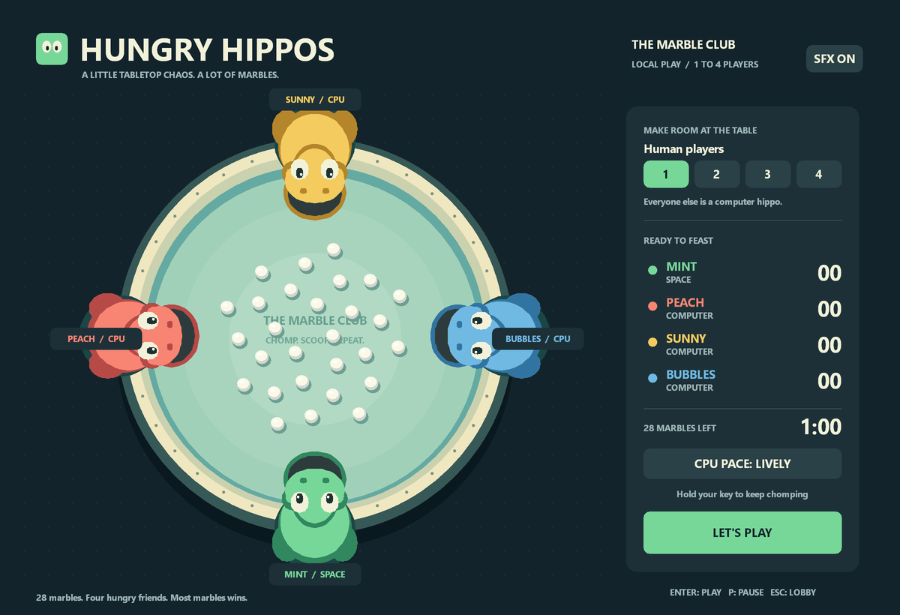
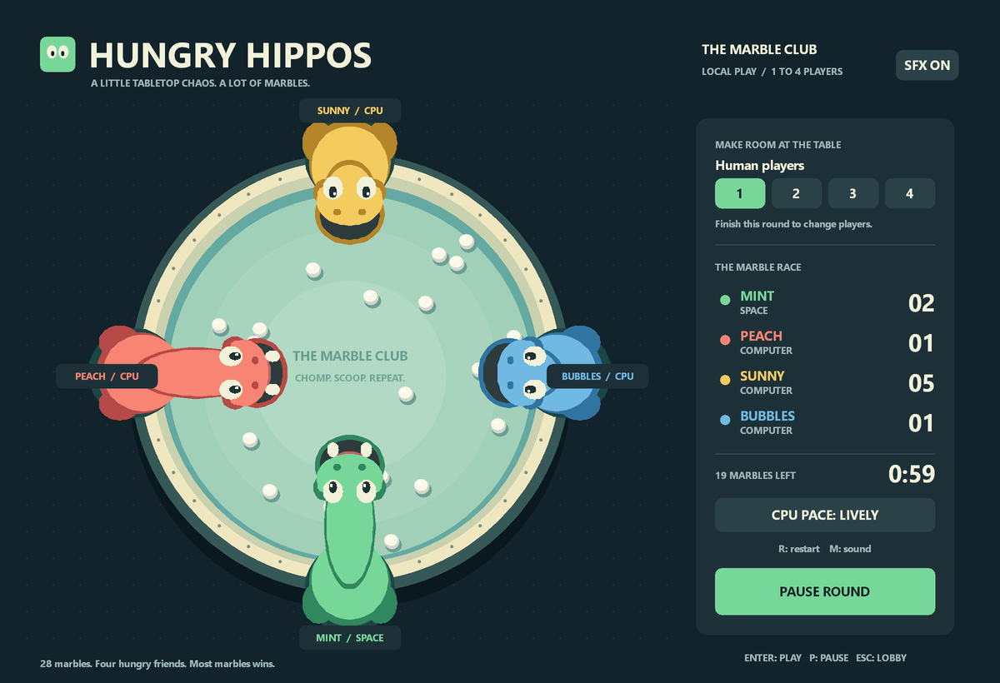

# Hungry Hippos

A complete native Windows game written in C11, inspired by the marble scooping tabletop game. All artwork and sound effects are generated by the program. This is an independent fan game.

**[Download the Windows game](https://github.com/agammann/hungryhippos/raw/refs/heads/main/HungryHippos.exe)** · **[Download the complete project](https://github.com/agammann/hungryhippos/archive/refs/heads/main.zip)** · **[Verification results](VERIFIED.md)**

**Display fix:** The current executable prepares the whole frame offscreen before displaying it. This removes the repeated dark clears that caused flashing in the original build. Download the current executable again if you have that earlier copy. Short chomp taps are now retained between simulation updates, and the pause title fits its panel.



## Play

Double click **HungryHippos.exe** or **Play.cmd**. No installation, internet, graphics library download, or account is needed. The included executable targets 64 bit Windows 10 and Windows 11.

Choose one to four human players, choose a computer pace, and click **LET'S PLAY** or press **Enter**. Unfilled seats become computer opponents. Scoop as many of the 28 marbles as you can. The round ends when all marbles have been eaten or after 60 seconds. Each marble is one point. The highest score wins; equal highest scores tie.

| Hippo | Position | Chomp key |
| :--- | :--- | :--- |
| Mint | Bottom | Space |
| Peach | Left | A |
| Sunny | Top | I |
| Bubbles | Right | L |

Tap for a single chomp or hold to chomp repeatedly. Human seats fill in the order shown. Every hippo has the same reach and recovery time. Timing a chomp as a marble passes the mouth helps you scoop it up.

| Control | Action |
| :--- | :--- |
| Enter | Start, replay, or resume |
| P | Pause or resume |
| R | Restart with a fresh countdown |
| Esc | Return to the lobby |
| M | Toggle sound |
| 1, 2, 3, 4 | Choose human player count in the lobby or results screen |
| D | Change computer pace in the lobby or results screen |

The game pauses automatically when its window loses focus. Resize the window freely; the board keeps its proportions. Some keyboards cannot register many simultaneous keys; use fewer human players if your keyboard drops inputs.

## Build from C source

Use a Windows LLVM MinGW or MinGW GCC compiler with the Windows SDK headers and libraries supplied by that toolchain. No game framework is required. This project uses Win32, GDI, and WinMM.

```powershell
powershell -ExecutionPolicy Bypass -File .\build.ps1 -Compiler C:\path\to\clang.exe
```

Or, with a suitable compiler on PATH:

```powershell
.\build.ps1
```

The build treats compiler warnings as errors and runs simulation tests. The portable game simulation lives in `src/game.c`; the Windows window, input, rendering, and audio live in `src/main.c`.

## Verification tools

`build/test_game.exe` exercises capture ownership, conservation of all 28 marbles, arena boundaries, finite physics, wall bounce, timeout, countdown, pause and resume, ties, restart, and 240 complete simulated games across every player count and computer pace.

`HungryHippos.exe --smoke-test` creates a hidden native window, exercises its message loop and input handlers, and writes `smoke-result.txt` in the working directory. Run through `Start-Process -Wait` in PowerShell to wait for this GUI program to finish.

`HungryHippos.exe --snapshot board.bmp` renders the lobby through the game's own renderer. Append `playing` to render an active simulated round.

The shipped executable is for Windows. The rendering and input code would need a different platform backend for Linux or macOS.

## Gameplay


