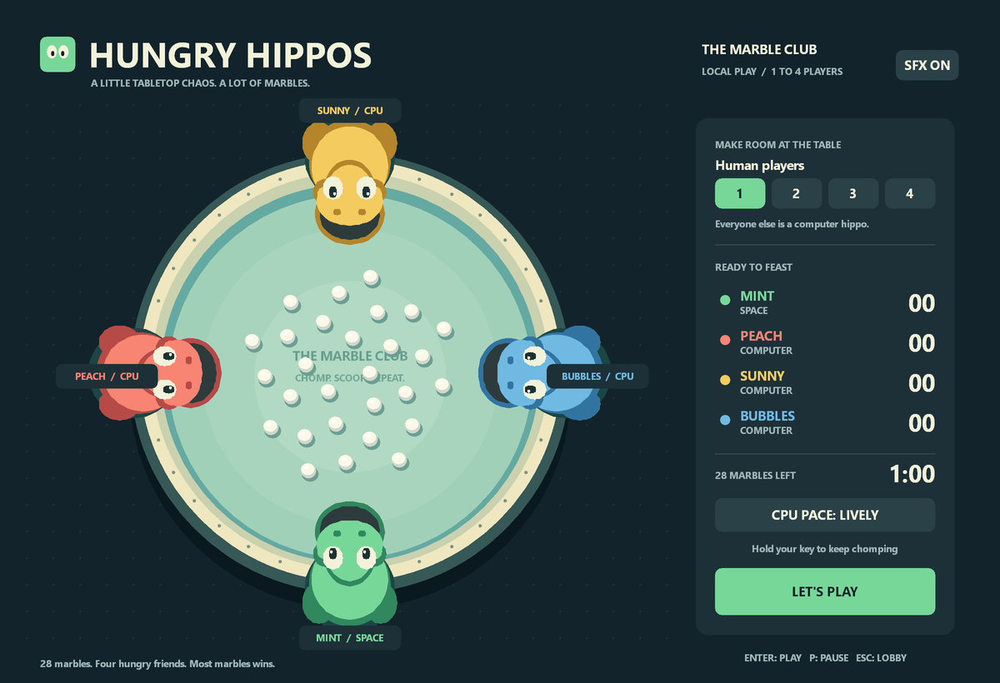
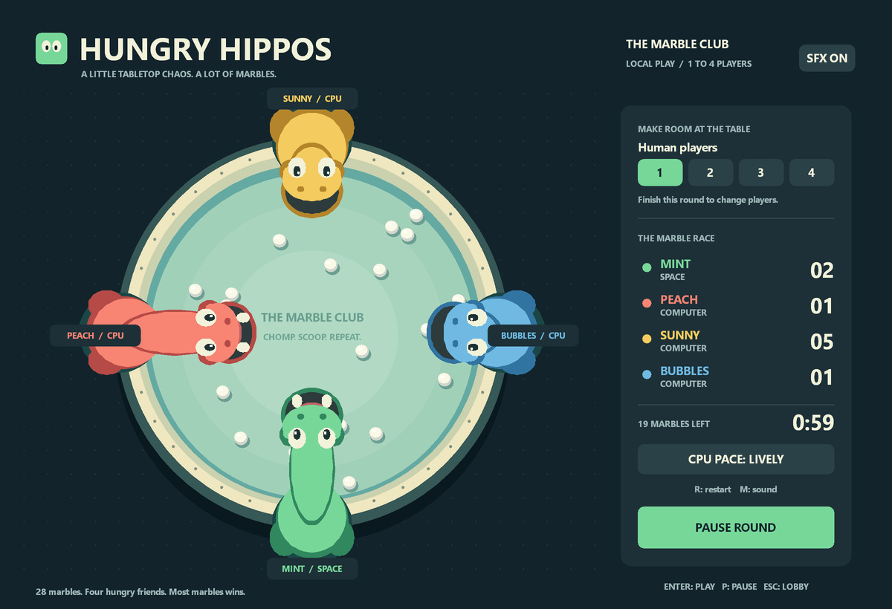

# Hungry Hippos

A native Windows marble-scooping game for one to four local players, with computer opponents filling empty seats. It is written in C11, draws its own board and synthesizes its sound effects. This is an independent fan game.

**[Download v1.0.0 for Windows x64](https://github.com/agammann/hungryhippos/releases/download/v1.0.0/hungryhippos_1.0.0_windows-x64.zip)** · **[Download matching C source](https://github.com/agammann/hungryhippos/releases/download/v1.0.0/hungryhippos_1.0.0_source.zip)** · **[Verification](VERIFIED.md)**



## First game

1. Download the Windows ZIP and extract the entire folder with Windows **Extract All**.
2. Open `HungryHippos.exe` or `Play.cmd` in the extracted folder. No installer, internet connection, account or additional game library is required. The portable executable targets Windows 10/11 x64 and is unsigned.
3. Leave **1 human player** selected and press **Enter**. After the three-second countdown, tap or hold **Space** to chomp as marbles approach Mint's mouth. The other three hippos are computers.
4. Scoop as many of the 28 marbles as possible. Each is one point. A round ends when all are eaten or after 60 seconds; the highest score wins and equal highest scores tie. Press **Enter** to play again.

Choose one to four humans and Gentle, Lively or Quick computer pace in the lobby. Human seats fill in this order:

| Hippo | Position | Chomp key |
| :--- | :--- | :--- |
| Mint | Bottom | Space |
| Peach | Left | A |
| Sunny | Top | I |
| Bubbles | Right | L |

Every hippo has the same reach and recovery time. Tap for one chomp or hold to repeat.

| Control | Action |
| :--- | :--- |
| Enter | Start, replay, or resume |
| P | Pause or resume |
| R | Restart the round with a fresh countdown and scores |
| Esc | Return to the lobby |
| M | Toggle sound |
| 1, 2, 3, 4 | Choose humans in the lobby or results screen |
| D | Change computer pace in the lobby or results screen |

The window pauses when it loses focus. Click it and resume with **Enter** or **P**. Resize it freely; the board keeps its proportions. The minimum window size is 850 × 610. Some keyboards cannot register all four chomp keys together; try your keys before a multiplayer round or use fewer human seats.

## Build and extend

Extract the source ZIP, then get the [LLVM MinGW 20260922 UCRT x64 toolchain](https://github.com/mstorsjo/llvm-mingw/releases/tag/20260922). In the source folder, run:

```powershell
powershell -ExecutionPolicy Bypass -File .\build.ps1 -Compiler C:\tools\llvm-mingw\bin\clang.exe
.\Play.cmd
```

Replace the example compiler path with the extracted toolchain's `bin\clang.exe`. The build uses Clang 23.1.2 and its sibling `windres.exe`, runs the simulation and native window checks, then writes `build/HungryHippos.exe`. A failed build keeps the previous successful game. You may omit `-Compiler` if a compatible compiler is on PATH or set in `CC`.

The source package contains C code rather than a prebuilt game. [Developer instructions](docs/development.md) cover the game loop, tests and release packaging. Win32, GDI and WinMM provide the Windows backend; Linux and macOS are not playable targets for this version.

## Upgrade and troubleshooting

Extract a new release into a separate folder and run its executable; there are no saved games, settings files or account data to migrate. Round scores, player count and sound selection reset on a fresh launch. Keep the old folder if you want to return to that version. `RELEASE.json` identifies the package's source commit, and the executable's Windows **Properties → Details** shows version 1.0.0. Release assets include `SHA256SUMS`; compare a downloaded ZIP with `Get-FileHash .\hungryhippos_1.0.0_windows-x64.zip -Algorithm SHA256`.

- **No executable:** use the Windows ZIP to play, or build the source ZIP first. `Play.cmd` reports the missing file and points to these options.
- **Keys seem unresponsive:** click the game window, resume a paused round, and confirm the human player count. Seats marked COMPUTER do not use human keys.
- **No sound:** check the **SFX ON** indicator (**M** toggles it), Windows volume and output device. Programmatic sound submission is checked; physical speaker and keyboard checks depend on the computer used.
- **Build fails:** confirm the compiler path and its `windres.exe`, and read the first error. Keep the last successful game in `build/`. The release ZIP requires no compiler.



The project is available under the [MIT license](LICENSE). [Third-party notices](THIRD_PARTY_NOTICES.md) accompany both packages.
